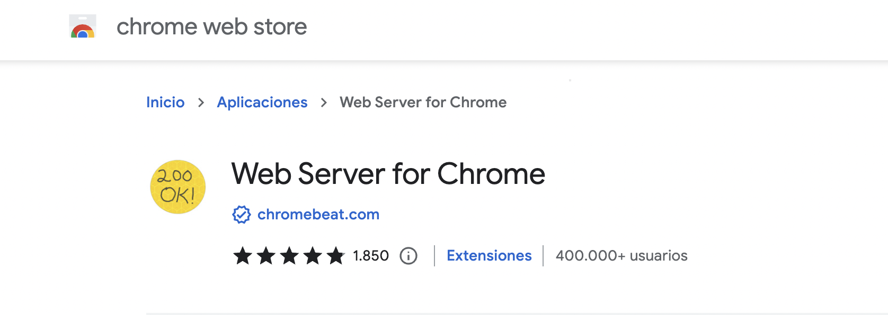
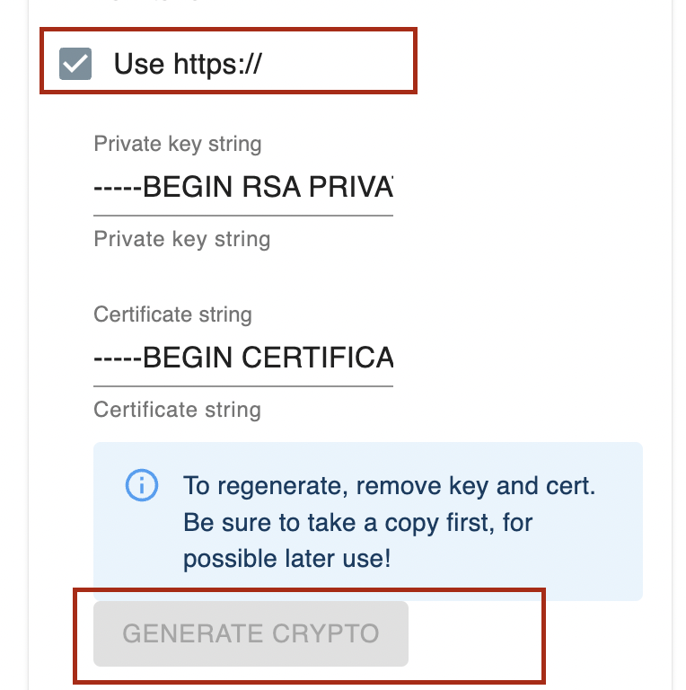
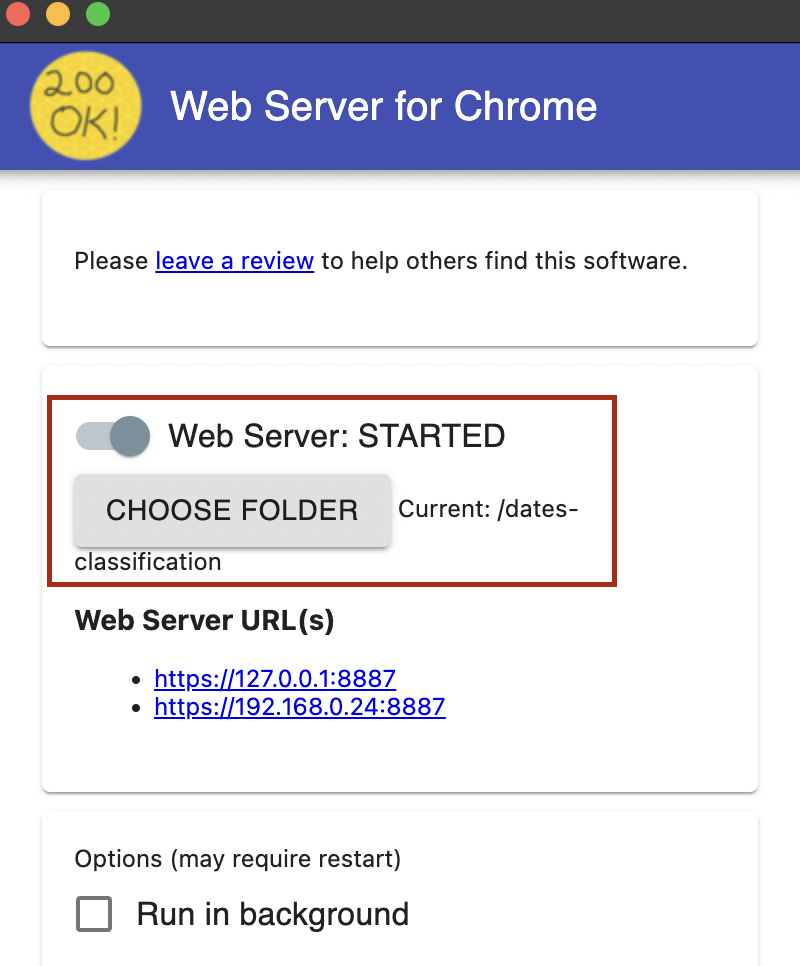

# Dates classification

## Configuration
Change the file js/variables.json with your env variables.

- **##labels##**: A JSON to show user friendly labels of the classes of the model.
```
{"pyramid_giza" : "Pyramid of Giza", "sydney_opera" : "Sydney Opera house"}
```
- **##modelId##**: Model OCID of the custom model. 

- **##visionServiceEndpoint##**: Endpoint of the python function to call vision service.

## Testing
For testing you only need a web-server. You can install the "Chrome web server" addon.

|    |            |            | 
|----------|:-------------:|:-------------:|
| |   |  

- Install chrome server addon
- Go to advanced options, generate certificate and enable https.
- Select folder, start server 
- Open the https url
